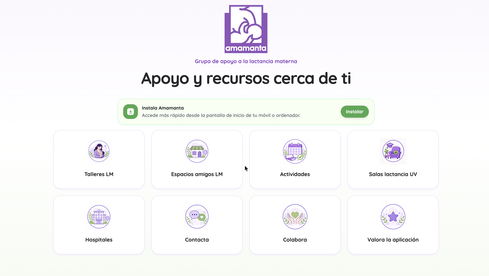
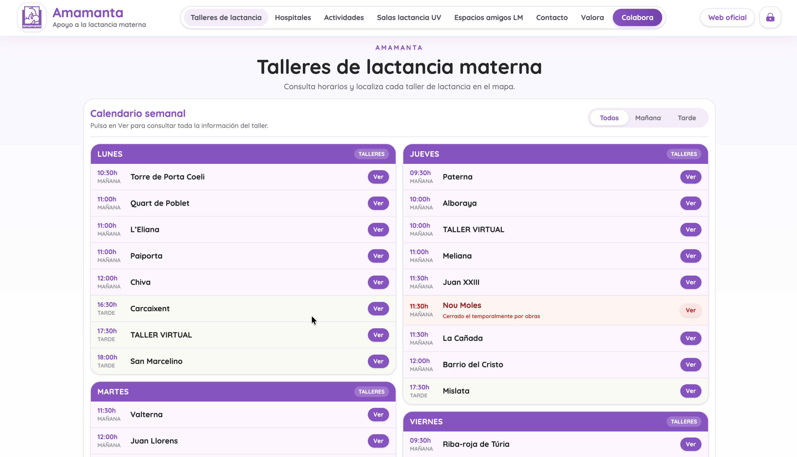
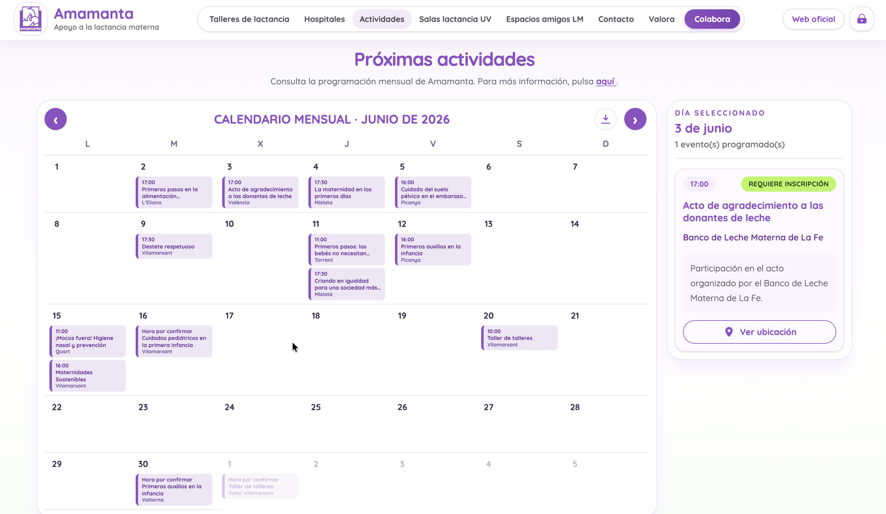
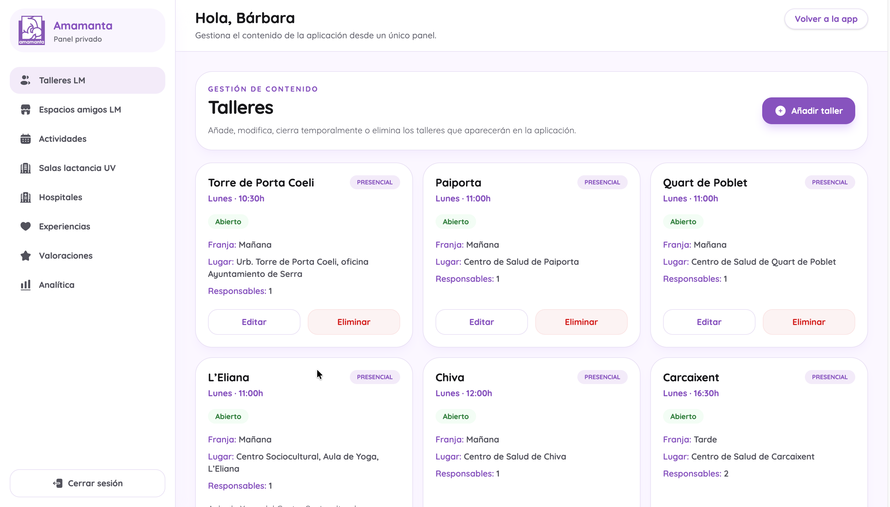

# App Amamanta

App Amamanta is a Progressive Web App (PWA) developed for the Amamanta association to provide easy access to information and services related to breastfeeding support.

The application allows users to browse workshops, events, accredited hospitals, university nursing rooms and breastfeeding-friendly places. It also includes a private administration panel for managing the application's content.

## Preview

<table>
  <tr>
    <td></td>
    <td></td>
  </tr>
  <tr>
    <td></td>
    <td></td>
  </tr>
</table>

## Features

- Browse breastfeeding workshops with a weekly calendar and interactive map.
- View upcoming activities in a monthly calendar.
- Find accredited hospitals and university nursing rooms.
- Discover breastfeeding-friendly places.
- Contact the association directly from the application.
- Submit feedback and ratings.
- Install the application as a Progressive Web App (PWA).
- Private administration panel for content management.

## Technologies

- Angular 19
- TypeScript
- Tailwind CSS
- Angular Router
- Angular Service Worker (PWA)
- Google Maps JavaScript API
- html-to-image

## Installation

Clone the repository:

```bash
git clone https://github.com/Samucastelloo6/amamanta-app.git
```

Go to the project directory:

```bash
cd amamanta-app
```

Install the dependencies:

```bash
npm install
```

Start the development server:

```bash
npm start
```

The application will be available at:

```text
http://localhost:4200
```

## Available Scripts

| Command         | Description                            |
| --------------- | -------------------------------------- |
| `npm start`     | Starts the development server.         |
| `npm run build` | Builds the application for production. |
| `npm run watch` | Builds the application in watch mode.  |
| `npm test`      | Runs the unit tests.                   |

## Deployment

The frontend is deployed on Vercel and communicates with a REST API developed with Node.js and Express.

## Project Structure

```
src/
├── app/
│   ├── admin/
│   ├── core/
│   ├── features/
│   └── shared/
├── environments/
└── styles/
```

## Live Demo

The application is available at:

<https://app.amamanta.es>

## Related Repository

Backend API:

<https://github.com/Samucastelloo6/amamanta-app/tree/main/backend>

## Author

Developed by **Samuel Castelló Felipe**.
